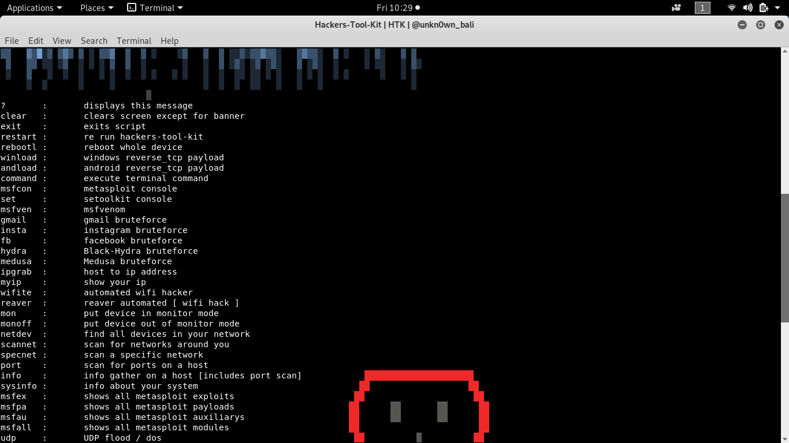
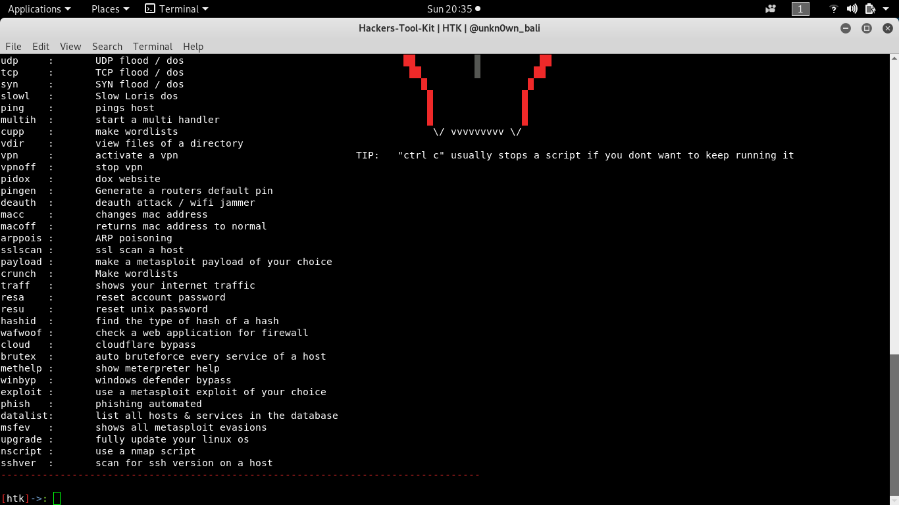
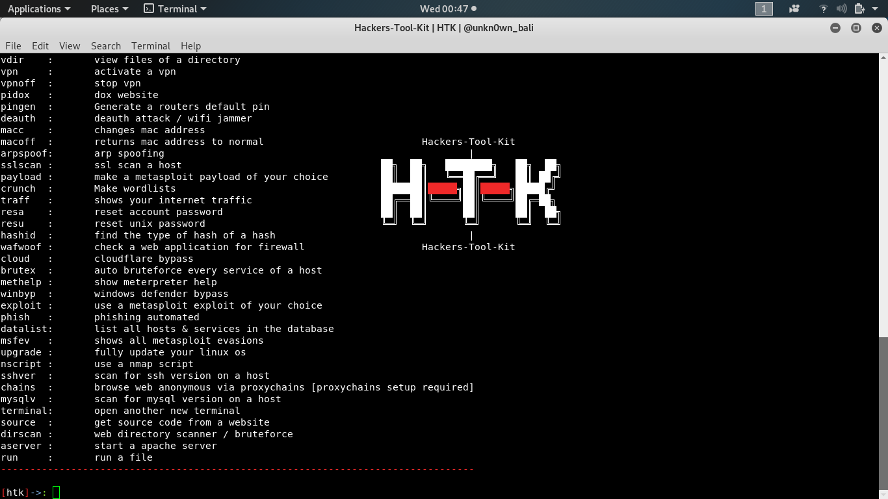
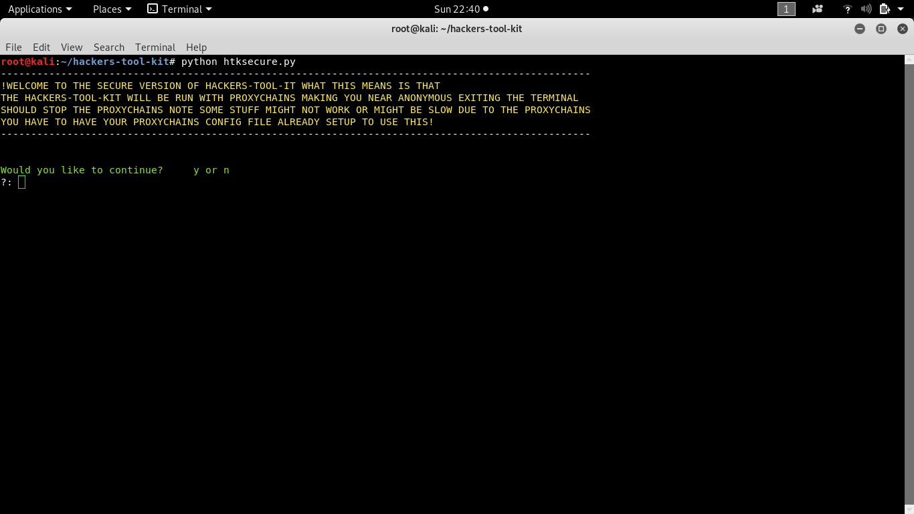
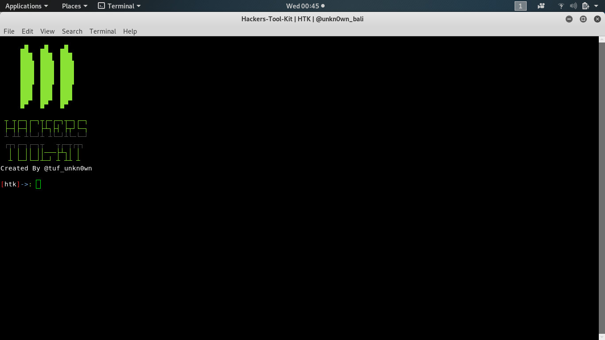
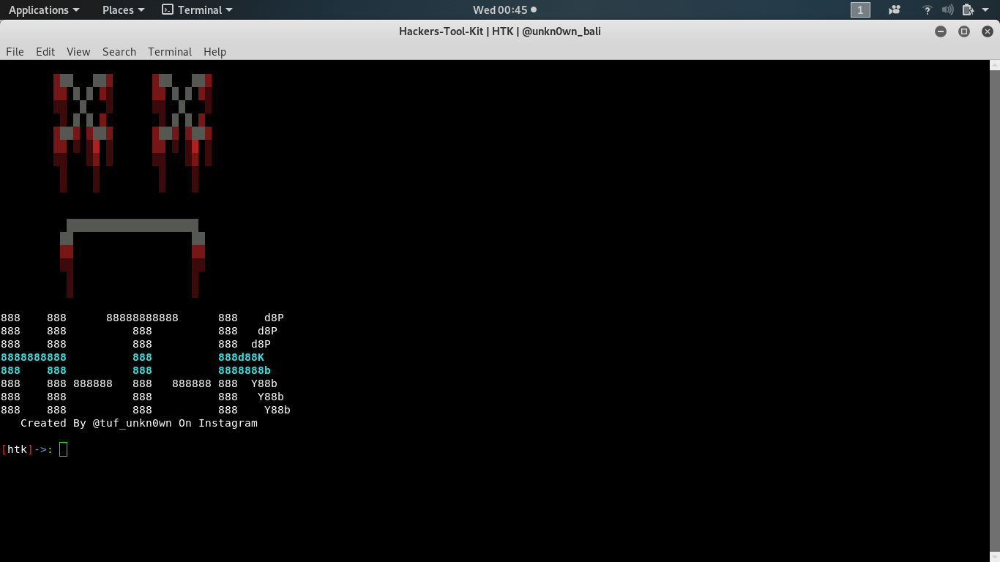
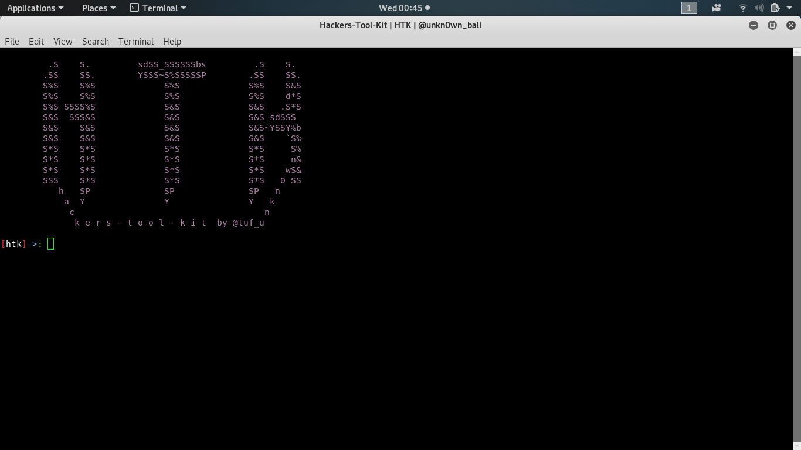

# hackers-tool-kit
Its a framework filled with alot of options and hacking tools you use directly in the script from brute forcing to payload making. Im still trying to think of what to add to the script. I now have another tool out called htkl-lite its hackers-tool-kit just not as big and messy. To see updates check on my instagram @tuf_unkn0wn or if there are any problems message me on instagram.

# install

* `git clone https://github.com/unkn0wnh4ckr/hackers-tool-kit`

* `cd hackers-tool-kit`

* `python install.py`

# Run

ROOT IS NOT REQUIRED TO RUN BUT IS RECOMMENDED

* `cd hackers-tool-kit`

* `python htk.py`

# HTK Secure

the htksecure.py file will run the hackers-tool-kit with proxychains and other tools making you anonymous when hacking but some stuff might be slow or not work... to run htk secure look below

* `cd hackers-tool-kit`

* `python htksecure.py`

# UPDATES
this is where i will try to put the most recent updates

* added a htk-lite option which runs my htk-lite tool

* added a dns spoofing option
