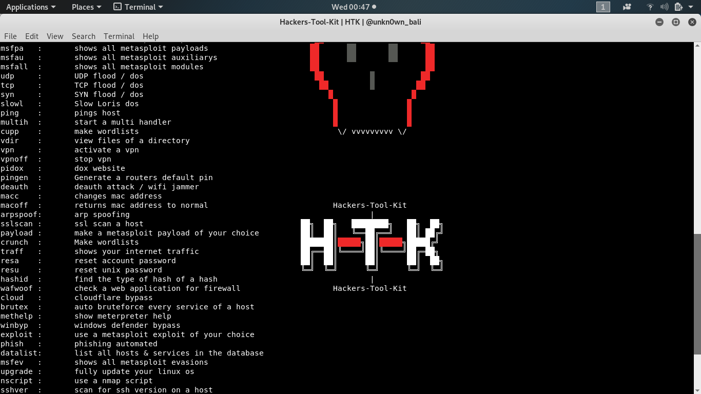

# hackers-tool-kit
Its a framework filled with alot of options and hacking tools you use directly in the script
from brute forcing to payload making im still adding more stuff to see updates check on 
my instagram @unkn0wn_bali

# install

* `git clone https://github.com/unkn0wnh4ckr/hackers-tool-kit`

* `cd hackers-tool-kit`

* `python install.py`

# Run

* `cd hackers-tool-kit`

* `python htk.py`

# HTK Secure

the htksecure.py file will run the hackers-tool-kit with proxychains and other tools making you anonymous when hacking but some stuff might be slow or not work... to run htk secure look below

* `cd hackers-tool-kit`

* `python htksecure.py`

# UPDATES
this is where i will try to put the most recent updates

* help banner update

* added a connect option

* added an about me option
